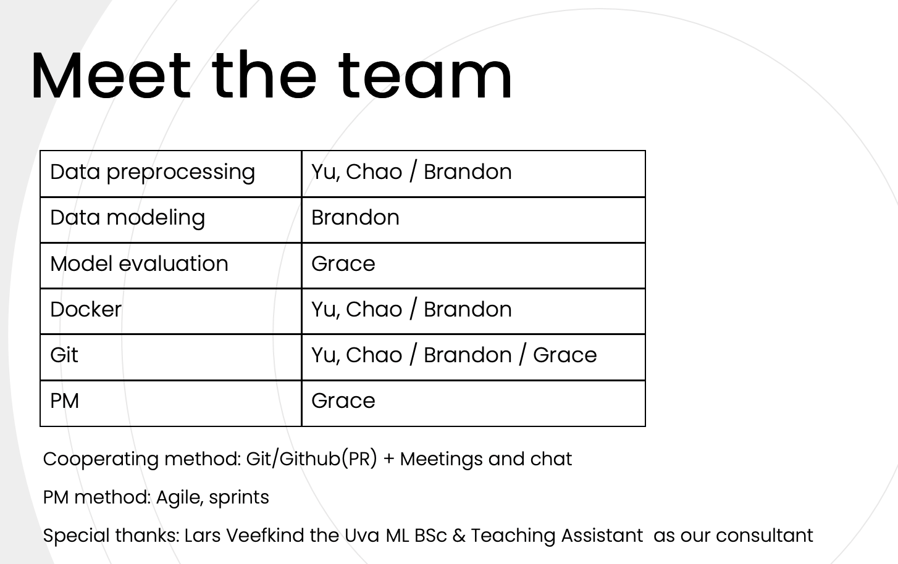

### :deciduous_tree: As Shachiku(しゃちく), we also love the planet!

* Make a Green energy model with simulated data from NL. Source data and credits - [Pyladies Amsterdam](https://github.com/pyladiesams/bootcamp-bringing-ML-models-into-production-intermediary-jun-aug2021)
* Working structure: 

### :deciduous_tree: Our Goal

* Stand on the giant's shoulder : Focus on uptimizing the configuation details within existed data files/Linear Regression ML model/model evaluation files instead of building a brand new model on our own.
* Get a dip of time-series ML.
* Finish National Taiwan University [ccClub advanced Python workshop 2021 spring](https://www.ccclub.io/home/) final project.
* Sharing the open source spirit with other Taiwanese developers.

### :deciduous_tree: Setup

* Our files suit the best with [Python 3.8.10](https://www.python.org/downloads/release/python-3810/) 
* Step 1: Install [Docker](https://docs.docker.com/), [Docker Desktop](https://www.docker.com/products/docker-desktop).
* Step 2: Type `docker login` in your terminal.
* Step 3: Type `docker pull c0004512000/ccclub-advanced-final` in your terminal.
* Step 4: Type `docker run -p [local_port]:[jupyter_default_port] c0004512000/ccclub-advanced-final` in your terminal to run the images.
        The `[jupyter_default_port]` is `8888`.
        An example: `docker run -p 10000:8888 c0004512000/ccclub-advanced-final`.
* Step 5: Type `http://localhost:[local_port]` in your browser as the url to open the Jupyter kernel. An example: `localhost:10000`.
* Step 6: Enjoy your exploration with the following files:
        `data-processing/prepare_data_with_outlier.ipynb`,`data-processing/prepare_data.ipynb`
        `data-modeling/model_training.ipynb`
        `model-evaluation/explore_predictions.ipynb`

#### :hot_pepper: An Extra Step! 

* If you want to evaluate different models, please type the below comments in your     terminal to run `model-evaluation/evaluate_model.py`: 

   * `python evaluate_model.py [model_name] [data_name]`
   * An example: `python evaluate_model.py lr_model_1 data_test_1`

* Please check the list below to find out all the possible pairs of `[model_name]`,    `[data_name]`:

  * `lr_model_1 data_test_1`,`lr_model_2 data_test_2`, `lr_model_3 data_test_3`,       `lr_model_4 data_test_4`

  * `lr_outliers_model_1 data_outlier_test_1`, `lr_outliers_model_2    data_outlier_test_2`, `lr_outliers_model_3 data_outlier_test_3`,   `lr_outliers_model_4 data_outlier_test_4`

### :deciduous_tree: Team work

* PM method: Agile, sprints

### :deciduous_tree: Authors

* [Yu Chao](https://github.com/troublecat55)
* [Grace](https://github.com/graceyfchang)
* [Brandon](https://github.com/c0004512000)